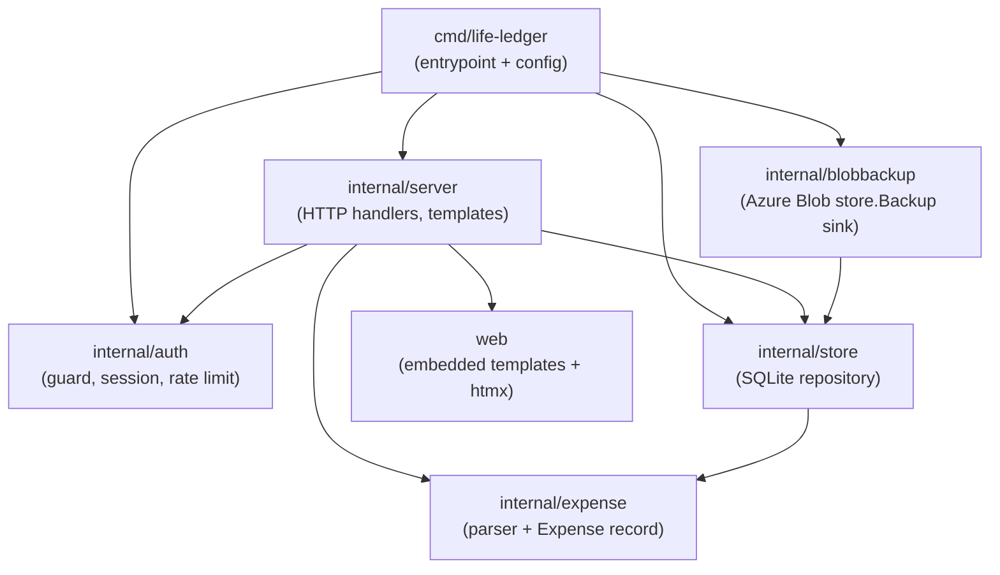
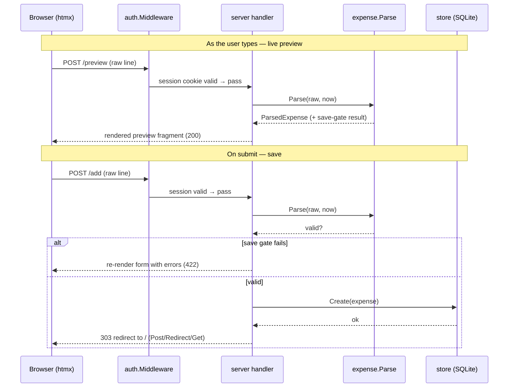
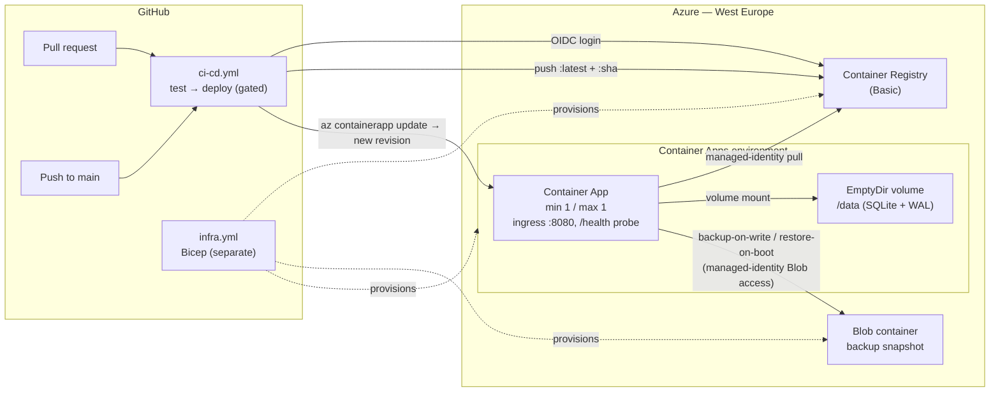

# Architecture

Life Ledger is a single, self-contained Go web service: one static binary that
serves server-rendered HTML enhanced with htmx, persists to an embedded SQLite
database, and guards everything behind a shared-password session. This document
is the living map of the system — its modules, how a request flows through them,
and how it is deployed. It links out to the [ADRs](adr/) for the *why*; keep it
current as modules are added.

> Domain language lives in [CONTEXT.md](../CONTEXT.md). This document is
> structure and implementation; that one is vocabulary.

## Module map

The whole application ships as one binary (`cmd/life-ledger`); templates, static
assets, and DB migrations are all `go:embed`'d, so there are no sidecar files.

```
cmd/life-ledger/     Entrypoint: reads config from the environment, wires the
                     store + auth guard + server, starts net/http with timeouts.
                     Embeds tzdata (import _ "time/tzdata") so "today" is correct
                     on a minimal container image (ADR-0005).
cmd/hashpw/          Dev helper: bcrypt-hash a password for LIFELEDGER_PASSWORD_HASH.

internal/expense/    Domain core. The free-text parser (raw line -> ParsedExpense)
                     and the Expense record. Pure functions, no I/O — the single
                     source of parse truth shared by the add, edit, and preview
                     paths. (ADR-0001, ADR-0002)
internal/store/      Persistence. A repository over one SQLite file via the
                     pure-Go modernc.org/sqlite driver; owns the self-creating
                     startup path and embedded goose migrations, and sets the
                     WAL / foreign_keys / busy_timeout pragmas. An optional
                     Backup sink (WithBackup) makes it durable on ephemeral
                     storage: a consistent VACUUM INTO snapshot is saved after
                     each write, and a cold boot restores from it. (ADR-0003)
internal/blobbackup/ Production implementation of store.Backup: a thin adapter
                     that snapshots the SQLite database to a single Azure Blob
                     (managed identity, no account key) and restores it on a cold
                     boot. The one place the Azure SDK enters the binary — every
                     test runs against in-process fakes of the same seam — so
                     local QA and CI stay zero-config and offline. (ADR-0003)
internal/auth/       Access control. The protective middleware, the HMAC-signed
                     stateless session cookie, and a per-IP in-memory login rate
                     limiter. (ADR-0004)
internal/server/     HTTP surface. Routes and handlers for the home page,
                     add/edit/delete, the live-preview fragment, login/logout,
                     and the unauthenticated health check; renders html/template
                     views and htmx fragments.
web/                 go:embed'd assets: templates/ (html/template sources) and
                     static/vendor/ (the version-pinned htmx script — no CDN).
```

### How the modules depend on each other



`internal/blobbackup` is wired only in `cmd/life-ledger`: when
`LIFELEDGER_BACKUP_BLOB_URL` is set, `main` constructs the Blob `Sink` and injects
it via `store.WithBackup`. It depends on `internal/store` only to implement that
package's `Backup` interface — the store never depends back on it, so the SDK stays
out of the persistence core and out of every test.

`internal/expense` is the leaf domain package — everything depends inward on it,
and it depends on nothing. The `server` package defines its own narrow `Store`
interface (the five methods it uses), so the HTTP layer depends on behaviour, not
on the concrete SQLite store — which is what lets the handlers be tested as a
black box against a real temp-file store.

## Request flow

A typical "add an expense" round-trip:



Two invariants worth noting:

- **One parser, three callers.** `/preview`, `/add`, and `/edit` all run the same
  `expense.Parse`, so the live preview shows exactly what would be stored, and the
  server re-validates the save gate even if a no-JS client skips the preview.
- **Auth is a gate, not a decoration.** The guard middleware wraps the whole mux;
  only `/login`, `/health`, and `/static/` bypass it (ADR-0004).

## Deployment topology

Deployed to Azure Container Apps, provisioned by Bicep, shipped by GitHub Actions
(ADR-0005). The app is always-warm and capped at a single replica to keep SQLite
single-writer. The database lives on a local **EmptyDir** volume — ephemeral disk
that honours SQLite's POSIX locks; durability is the store module's job, which
backs the database up to a **Blob container** after every write and restores it
on a cold boot (ADR-0003).



- **CI/CD** (`ci-cd.yml`): one gated workflow — tests run on every PR and push to
  main; deploy runs only on push to main, only after tests pass.
- **Infra** (`infra.yml`): separate, on dispatch or `infra/**` changes; idempotent
  Bicep apply.
- **Auth to Azure**: OIDC federated identity — no long-lived secret in GitHub.
- **Secrets**: the app's `LIFELEDGER_PASSWORD_HASH` and `LIFELEDGER_SESSION_KEY`
  reach the container as ACA secrets. Setup: [docs/deployment/first-deploy.md](deployment/first-deploy.md).

## Configuration surface

| Env var | Set by | Purpose |
| --- | --- | --- |
| `LIFELEDGER_ADDR` | default `:8080` | Listen address. |
| `LIFELEDGER_DB_PATH` | Bicep → `/data/expenses.db` | SQLite file on the mounted volume. |
| `LIFELEDGER_BACKUP_BLOB_URL` | Bicep → storage container URL | Azure Blob container for backup-on-write / restore-on-boot (managed identity). Unset locally/CI → no sink, pure local file, no Azure call. |
| `LIFELEDGER_PASSWORD_HASH` | ACA secret | bcrypt hash of the shared password (required). |
| `LIFELEDGER_SESSION_KEY` | ACA secret | Session-cookie signing secret (required in prod). |
| `LIFELEDGER_SECURE_COOKIE` | Bicep → `true` | `Secure` flag on the session cookie. |
| `TZ` | Bicep → `Europe/Madrid` | Selects the embedded zoneinfo so "today" is the local day. |

## Decision record

- [ADR-0001](adr/0001-stored-expense-record-shape.md) — stored Expense record shape
- [ADR-0002](adr/0002-free-text-entry-syntax.md) — free-text entry syntax
- [ADR-0003](adr/0003-persistence-and-storage.md) — persistence & storage (SQLite)
- [ADR-0004](adr/0004-access-model-auth.md) — access model / auth
- [ADR-0005](adr/0005-deploy-azure-cicd.md) — deploy to Azure via Bicep + GitHub Actions
