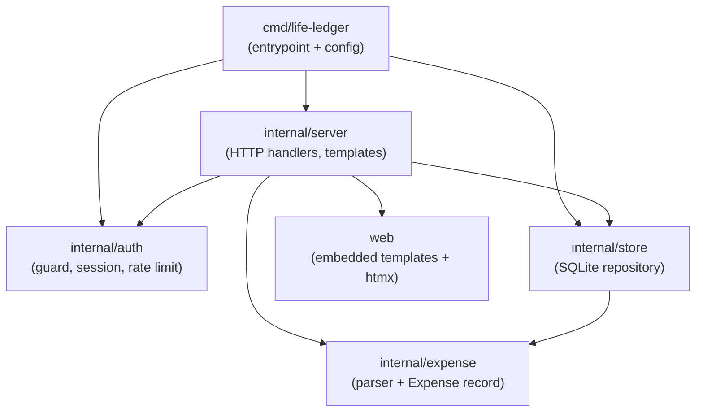
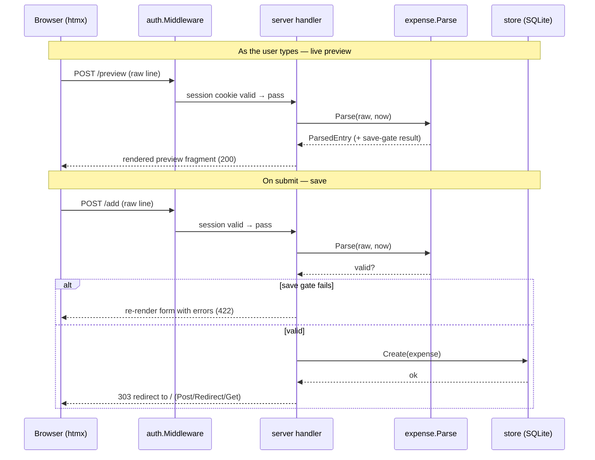
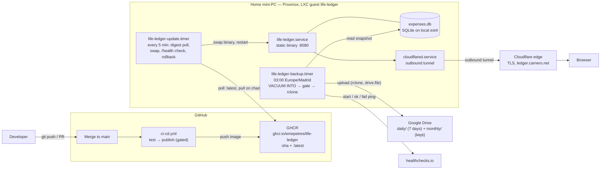

# Architecture

Life Ledger is a single, self-contained Go web service: one static binary that
serves server-rendered HTML enhanced with htmx, persists to an embedded SQLite
database, and guards everything behind a shared-password session. This document
is the living map of the system — its modules, how a request flows through them,
and how it is deployed. It links out to the [ADRs](adr/) for the *why*; keep it
current as modules are added.

> Domain language lives in [CONTEXT.md](../CONTEXT.md). This document is
> structure and implementation; that one is vocabulary.

## Module map

The whole application ships as one binary (`cmd/life-ledger`); templates, static
assets, and DB migrations are all `go:embed`'d, so there are no sidecar files.

```
cmd/life-ledger/     Entrypoint: reads config from the environment, wires the
                     store + auth guard + server, starts net/http with timeouts.
                     Embeds tzdata (import _ "time/tzdata") so "today" is correct
                     on a minimal container image (ADR-0005).
cmd/hashpw/          Dev helper: bcrypt-hash a password for LIFELEDGER_PASSWORD_HASH.
cmd/afk-dispatch/    AFK subsystem: thin JSON wrapper over internal/afk.Decide for
                     the GitHub Actions activation job.
cmd/dashboard/       AFK subsystem: builds the self-contained index.html dashboard
                     — a thin gh-CLI fetch plus a pure, fixture-testable
                     render(DashboardData). Mermaid.js is vendored-inline so the
                     HTML has zero external fetches.

internal/afk/        AFK subsystem: the pure decision core (Decide) that routes one
                     issue to a run — skill derivation, branch-resolution ladder,
                     blocker gate. No I/O. The away-from-keyboard dispatch system is
                     documented in docs/graph-engineering/system.md.
internal/expense/    Domain core. The free-text parser (raw line -> ParsedEntry)
                     and the Expense and Income records — two public types over a
                     shared unexported `entry` base; an Income is an expense-but-
                     negative, minus the `*` split marker, and a Payback is an
                     Income linked to an Expense. The entry gate:
                     Submit(Intent, raw, today) parses the line and applies the
                     Intent's kind rules (add, add payback, edit expense, edit
                     income — an edit keeps the record's kind; the edit window
                     lives on the edit Intents), returning the ready-to-store
                     record or the save-gate errors. Pure functions, no I/O —
                     the single source of parse and kind truth shared by the
                     add, edit, and preview paths. (ADR-0001, ADR-0002,
                     ADR-0008, ADR-0009)
internal/store/      Persistence. A repository over one SQLite file via the
                     pure-Go modernc.org/sqlite driver; owns the self-creating
                     startup path and embedded goose migrations, and sets the
                     WAL / foreign_keys / synchronous=FULL / busy_timeout
                     pragmas. Two tables: `expense` and `income`
                     (income.linked_expense_id -> expense.id ON DELETE CASCADE);
                     a thin per-table repository (List / ListIncomes +
                     per-record CRUD) — netting and interleaving are the
                     server's job, not the store's. The binary has no backup
                     role (ADR-0012): it opens a local file and logs whether it
                     was "created new" or "opened existing".
                     (ADR-0003, ADR-0009, ADR-0012)
internal/auth/       Access control. The protective middleware, the HMAC-signed
                     stateless session cookie, and a per-IP in-memory login rate
                     limiter. (ADR-0004)
internal/server/     HTTP surface. Routes and handlers for the home page,
                     add/preview, and one kind-qualified edit path plus delete
                     (/edit/{kind}/{id}, /delete/{kind}/{id}) — each rebuilds
                     the box's Intent (form hidden fields or route) and stores
                     whatever record expense.Submit returns, so preview and
                     save can't disagree; the pre-linked
                     payback start (/payback/{expenseID}), the Splittypie export
                     (GET /export/splittypie?from=YYYY-MM-DD — a text download of
                     Split expenses as splittypie quick-add lines, at net cost;
                     stateless), login/logout, and the
                     unauthenticated health check. view.go assembles the net-first,
                     day-grouped feed (net cost derived at render time; stored
                     amount stays full) into one discriminated rowView; renders
                     html/template views and htmx fragments. (ADR-0009)
web/                 go:embed'd assets: templates/ (html/template sources) and
                     static/vendor/ (the version-pinned htmx script — no CDN).
```

### How the modules depend on each other


```mermaid
flowchart TD
    main["cmd/life-ledger<br/>(entrypoint + config)"]
    server["internal/server<br/>(HTTP handlers, templates)"]
    auth["internal/auth<br/>(guard, session, rate limit)"]
    store["internal/store<br/>(SQLite repository)"]
    expense["internal/expense<br/>(parser + Expense record)"]
    web["web<br/>(embedded templates + htmx)"]

    main --> server
    main --> auth
    main --> store
    server --> auth
    server --> store
    server --> expense
    server --> web
    store --> expense
```

`internal/expense` is the leaf domain package — everything depends inward on it,
and it depends on nothing. The `server` package defines its own narrow `Store`
interface (the expense CRUD + list plus the income CRUD + `ListIncomes`), so the
HTTP layer depends on behaviour, not on the concrete SQLite store — which is what
lets the handlers be tested as a black box against a real temp-file store.

## Request flow

A typical "add an expense" round-trip:


```mermaid
sequenceDiagram
    participant B as Browser (htmx)
    participant M as auth.Middleware
    participant H as server handler
    participant P as expense.Parse
    participant S as store (SQLite)

    Note over B,S: As the user types — live preview
    B->>M: POST /preview (raw line)
    M->>H: session cookie valid → pass
    H->>P: Parse(raw, now)
    P-->>H: ParsedEntry (+ save-gate result)
    H-->>B: rendered preview fragment (200)

    Note over B,S: On submit — save
    B->>M: POST /add (raw line)
    M->>H: session valid → pass
    H->>P: Parse(raw, now)
    P-->>H: valid?
    alt save gate fails
        H-->>B: re-render form with errors (422)
    else valid
        H->>S: Create(expense)
        S-->>H: ok
        H-->>B: 303 redirect to / (Post/Redirect/Get)
    end
```

Two invariants worth noting:

- **One parser, three callers.** `/preview`, `/add`, and `/edit` all run the same
  `expense.Parse`, so the live preview shows exactly what would be stored, and the
  server re-validates the save gate even if a no-JS client skips the preview.
- **Auth is a gate, not a decoration.** The guard middleware wraps the whole mux;
  only `/login`, `/health`, and `/static/` bypass it (ADR-0004).

## Deployment topology

Deployed on the home mini-PC (Proxmox) in an unprivileged LXC guest, `life-ledger`
(CT 101), as one static binary under systemd (ADR-0010, ADR-0011). GitHub Actions
publishes the image to GHCR; a timer on the guest pulls new digests and swaps the
binary. Public traffic arrives through an outbound-only Cloudflare Tunnel at
`ledger.carnero.net` (ADR-0013): the guest has no inbound firewall rules. The DB
is a SQLite file on the guest's local ext4 (ADR-0012), and a nightly box-side job
snapshots it to Google Drive (ADR-0014).


```mermaid
flowchart LR
    dev["Developer"]

    subgraph GH["GitHub"]
        main["Merge to main"]
        cicd["ci-cd.yml<br/>test → publish (gated)"]
        ghcr["GHCR<br/>ghcr.io/emepetres/life-ledger<br/>:sha + :latest"]
    end

    subgraph BOX["Home mini-PC — Proxmox, LXC guest life-ledger"]
        updater["life-ledger-update.timer<br/>every 5 min: digest poll,<br/>swap, /health check, rollback"]
        unit["life-ledger.service<br/>static binary :8080"]
        db[("expenses.db<br/>SQLite on local ext4")]
        cfd["cloudflared.service<br/>outbound tunnel"]
        backup["life-ledger-backup.timer<br/>03:00 Europe/Madrid<br/>VACUUM INTO → gate → rclone"]
    end

    edge["Cloudflare edge<br/>TLS, ledger.carnero.net"]
    browser["Browser"]
    drive["Google Drive<br/>daily/ (7 days) + monthly/ (kept)"]
    hc["healthchecks.io"]

    dev -->|"git push / PR"| main
    main --> cicd
    cicd -->|"push image"| ghcr
    updater -->|"poll :latest, pull on change"| ghcr
    updater -->|"swap binary, restart"| unit
    unit --- db
    unit --> cfd
    cfd -->|"outbound tunnel"| edge
    edge --> browser
    backup -->|"read snapshot"| db
    backup -->|"upload (rclone, drive.file)"| drive
    backup -->|"start / ok / fail ping"| hc
```

- **CI/CD** (`ci-cd.yml`): one gated workflow — tests run on every PR and push to
  main; publish (image to GHCR as `:<sha>` and `:latest`) runs only on push to
  main, only after tests pass and only when image-affecting files changed.
  `ghcr-cleanup.yml` prunes the package weekly, keeping the 10 newest versions.
  Nothing in CI reaches the box: it only publishes.
- **Updater** (`life-ledger-update`, ADR-0011): every 5 minutes it compares the
  `:latest` digest with the last good one, extracts the binary from the image,
  swaps it in, and polls `/health`. A failing digest is rolled back and not
  retried.
- **Ingress** (`cloudflared`, ADR-0013): TLS ends at Cloudflare's edge; the tunnel
  forwards to `127.0.0.1:8080`. The guest's firewall allows DNS, the gateway and
  the internet outbound, and drops the rest of the LAN.
- **Nightly backup** (`life-ledger-backup`, ADR-0014): a snapshot with
  `VACUUM INTO`, gated on `integrity_check` and the migration version, uploaded to
  Google Drive as `daily/YYYY-MM-DD.db` (plus `monthly/YYYY-MM.db` on the 1st).
  Dailies older than 7 days are pruned; month-ends are kept. healthchecks.io
  emails on a missed night or a gate failure. Recovery is operator-driven via the
  **[restore runbook](deployment/restore-runbook.md)**.
- **Secrets**: `LIFELEDGER_PASSWORD_HASH` and `LIFELEDGER_SESSION_KEY` live in
  `/etc/life-ledger/app.env` (root-only); the tunnel token and the backup keys have
  their own files so the app process never sees them. The password manager is
  canonical. Setup: [mini-PC runbook](deployment/mini-pc/README.md).

## Configuration surface

| Env var | Set by | Purpose |
| --- | --- | --- |
| `LIFELEDGER_ADDR` | default `:8080` | Listen address. |
| `LIFELEDGER_DB_PATH` | unit → `/var/lib/life-ledger/expenses.db` | SQLite file on the guest's local disk. |
| `LIFELEDGER_PASSWORD_HASH` | `app.env` | bcrypt hash of the shared password (required). |
| `LIFELEDGER_SESSION_KEY` | `app.env` | Session-cookie signing secret (required in prod). |
| `LIFELEDGER_SECURE_COOKIE` | unit → `true` | `Secure` flag on the session cookie. |
| `TZ` | unit → `Europe/Madrid` | Selects the embedded zoneinfo so "today" is the local day. |

## Decision record

- [ADR-0001](adr/0001-stored-expense-record-shape.md) — stored Expense record shape
- [ADR-0002](adr/0002-free-text-entry-syntax.md) — free-text entry syntax
- [ADR-0003](adr/0003-persistence-and-storage.md) — persistence & storage (SQLite)
- [ADR-0004](adr/0004-access-model-auth.md) — access model / auth
- [ADR-0005](adr/0005-deploy-azure-cicd.md) — deploy to Azure via Bicep + GitHub Actions *(superseded by ADR-0010)*
- [ADR-0006](adr/0006-user-assigned-identity-for-acr-pull.md) — user-assigned identity for ACR pull *(superseded by ADR-0010)*
- [ADR-0007](adr/0007-scheduled-retained-backup.md) — scheduled retained backup + restore runbook
- [ADR-0008](adr/0008-canonical-entry-line-edit.md) — canonical entry line on edit; edits capped at 12 months
- [ADR-0009](adr/0009-income-and-paybacks.md) — income & paybacks: record shape, entry syntax, net cost
- [ADR-0010](adr/0010-host-home-mini-pc.md) — host on the home mini-PC (leaving Azure); best-effort availability, near-zero RPO, portability invariant
- [ADR-0011](adr/0011-runtime-lxc-static-binary.md) — run the static binary in an unprivileged LXC, pulled from the GHCR image
- [ADR-0012](adr/0012-storage-durability-on-the-box.md) — storage durability on the box: no in-app backup
- [ADR-0013](adr/0013-public-ingress-cloudflare-tunnel.md) — public ingress via Cloudflare Tunnel at `ledger.carnero.net`
- [ADR-0014](adr/0014-nightly-offsite-snapshot-to-google-drive.md) — nightly offsite snapshot to Google Drive *(supersedes ADR-0007)*

Operational runbooks live in [docs/deployment/](deployment/): the [mini-PC runbook](deployment/mini-pc/README.md) and the [restore runbook](deployment/restore-runbook.md).
