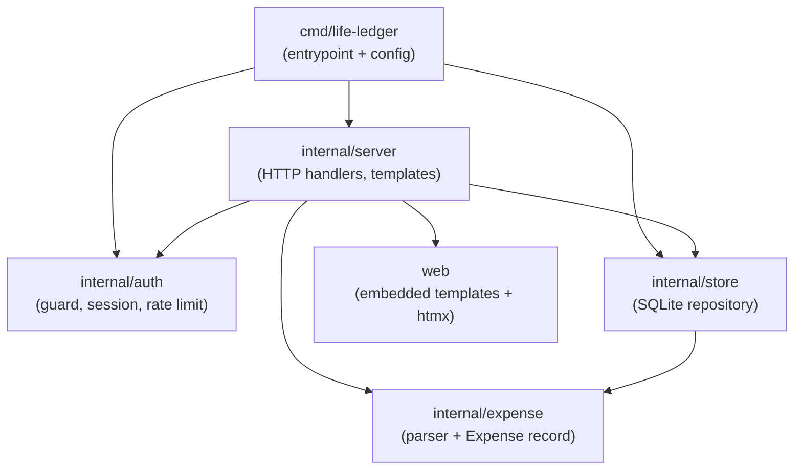
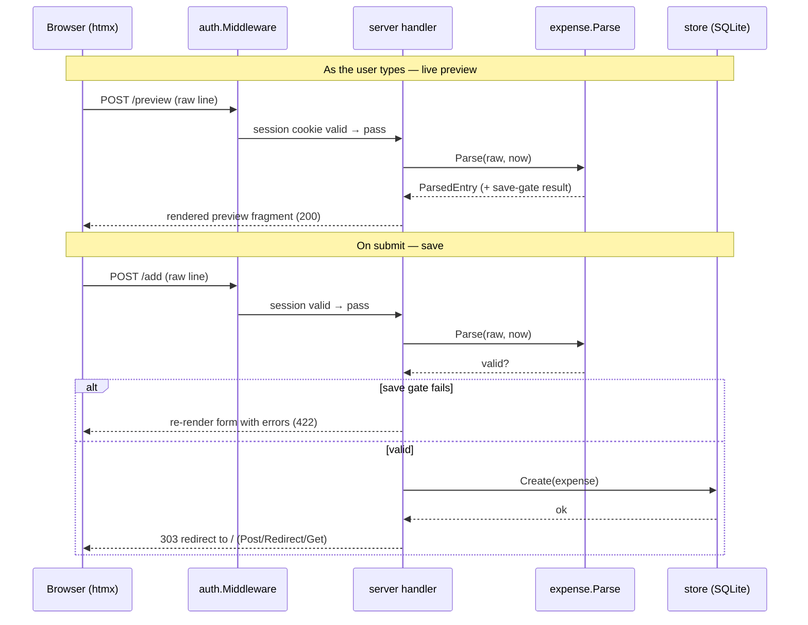
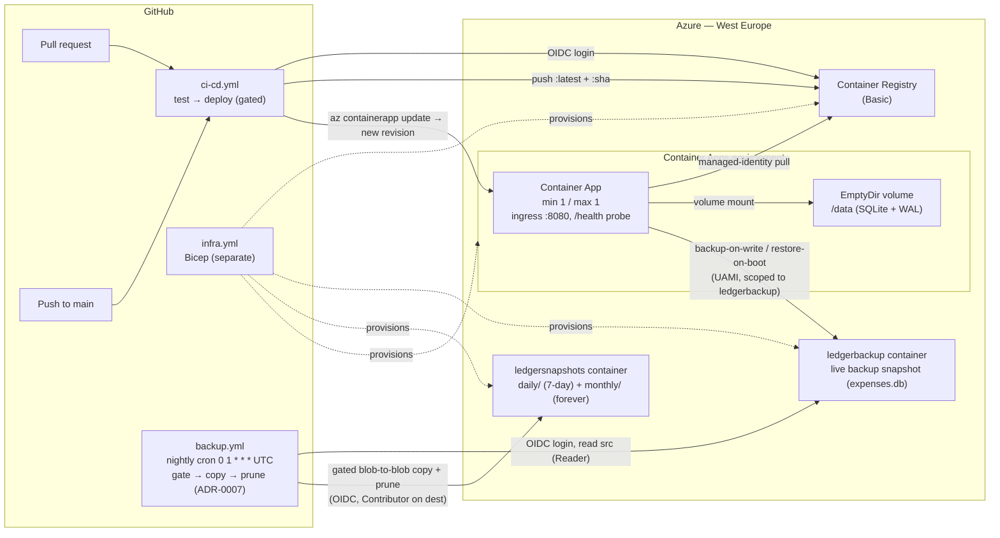

# Architecture

Life Ledger is a single, self-contained Go web service: one static binary that
serves server-rendered HTML enhanced with htmx, persists to an embedded SQLite
database, and guards everything behind a shared-password session. This document
is the living map of the system — its modules, how a request flows through them,
and how it is deployed. It links out to the [ADRs](adr/) for the *why*; keep it
current as modules are added.

> Domain language lives in [CONTEXT.md](../CONTEXT.md). This document is
> structure and implementation; that one is vocabulary.

## Module map

The whole application ships as one binary (`cmd/life-ledger`); templates, static
assets, and DB migrations are all `go:embed`'d, so there are no sidecar files.

```
cmd/life-ledger/     Entrypoint: reads config from the environment, wires the
                     store + auth guard + server, starts net/http with timeouts.
                     Embeds tzdata (import _ "time/tzdata") so "today" is correct
                     on a minimal container image (ADR-0005).
cmd/hashpw/          Dev helper: bcrypt-hash a password for LIFELEDGER_PASSWORD_HASH.
cmd/afk-dispatch/    AFK subsystem: thin JSON wrapper over internal/afk.Decide for
                     the GitHub Actions activation job.
cmd/dashboard/       AFK subsystem: builds the self-contained index.html dashboard
                     — a thin gh-CLI fetch plus a pure, fixture-testable
                     render(DashboardData). Mermaid.js is vendored-inline so the
                     HTML has zero external fetches.

internal/afk/        AFK subsystem: the pure decision core (Decide) that routes one
                     issue to a run — skill derivation, branch-resolution ladder,
                     blocker gate. No I/O. The away-from-keyboard dispatch system is
                     documented in docs/graph-engineering/system.md.
internal/expense/    Domain core. The free-text parser (raw line -> ParsedEntry)
                     and the Expense and Income records — two public types over a
                     shared unexported `entry` base; an Income is an expense-but-
                     negative, minus the `*` split marker, and a Payback is an
                     Income linked to an Expense. Pure functions, no I/O — the
                     single source of parse truth shared by the add, edit, and
                     preview paths. (ADR-0001, ADR-0002, ADR-0009)
internal/store/      Persistence. A repository over one SQLite file via the
                     pure-Go modernc.org/sqlite driver; owns the self-creating
                     startup path and embedded goose migrations, and sets the
                     WAL / foreign_keys / synchronous=FULL / busy_timeout
                     pragmas. Two tables: `expense` and `income`
                     (income.linked_expense_id -> expense.id ON DELETE CASCADE);
                     a thin per-table repository (List / ListIncomes +
                     per-record CRUD) — netting and interleaving are the
                     server's job, not the store's. The binary has no backup
                     role (ADR-0012): it opens a local file and logs whether it
                     was "created new" or "opened existing".
                     (ADR-0003, ADR-0009, ADR-0012)
internal/auth/       Access control. The protective middleware, the HMAC-signed
                     stateless session cookie, and a per-IP in-memory login rate
                     limiter. (ADR-0004)
internal/server/     HTTP surface. Routes and handlers for the home page,
                     add/preview (shared by expenses and incomes, branching on the
                     parsed IsIncome flag), kind-qualified edit/delete
                     (/edit/{kind}/{id}, /delete/{kind}/{id}), the pre-linked
                     payback start (/payback/{expenseID}), login/logout, and the
                     unauthenticated health check. view.go assembles the net-first,
                     day-grouped feed (net cost derived at render time; stored
                     amount stays full) into one discriminated rowView; renders
                     html/template views and htmx fragments. (ADR-0009)
web/                 go:embed'd assets: templates/ (html/template sources) and
                     static/vendor/ (the version-pinned htmx script — no CDN).
```

### How the modules depend on each other


```mermaid
flowchart TD
    main["cmd/life-ledger<br/>(entrypoint + config)"]
    server["internal/server<br/>(HTTP handlers, templates)"]
    auth["internal/auth<br/>(guard, session, rate limit)"]
    store["internal/store<br/>(SQLite repository)"]
    expense["internal/expense<br/>(parser + Expense record)"]
    web["web<br/>(embedded templates + htmx)"]

    main --> server
    main --> auth
    main --> store
    server --> auth
    server --> store
    server --> expense
    server --> web
    store --> expense
```

`internal/expense` is the leaf domain package — everything depends inward on it,
and it depends on nothing. The `server` package defines its own narrow `Store`
interface (the expense CRUD + list plus the income CRUD + `ListIncomes`), so the
HTTP layer depends on behaviour, not on the concrete SQLite store — which is what
lets the handlers be tested as a black box against a real temp-file store.

## Request flow

A typical "add an expense" round-trip:


```mermaid
sequenceDiagram
    participant B as Browser (htmx)
    participant M as auth.Middleware
    participant H as server handler
    participant P as expense.Parse
    participant S as store (SQLite)

    Note over B,S: As the user types — live preview
    B->>M: POST /preview (raw line)
    M->>H: session cookie valid → pass
    H->>P: Parse(raw, now)
    P-->>H: ParsedEntry (+ save-gate result)
    H-->>B: rendered preview fragment (200)

    Note over B,S: On submit — save
    B->>M: POST /add (raw line)
    M->>H: session valid → pass
    H->>P: Parse(raw, now)
    P-->>H: valid?
    alt save gate fails
        H-->>B: re-render form with errors (422)
    else valid
        H->>S: Create(expense)
        S-->>H: ok
        H-->>B: 303 redirect to / (Post/Redirect/Get)
    end
```

Two invariants worth noting:

- **One parser, three callers.** `/preview`, `/add`, and `/edit` all run the same
  `expense.Parse`, so the live preview shows exactly what would be stored, and the
  server re-validates the save gate even if a no-JS client skips the preview.
- **Auth is a gate, not a decoration.** The guard middleware wraps the whole mux;
  only `/login`, `/health`, and `/static/` bypass it (ADR-0004).

## Deployment topology

Deployed to Azure Container Apps, provisioned by Bicep, shipped by GitHub Actions
(ADR-0005). The app is always-warm and capped at a single replica to keep SQLite
single-writer. The database lives on a local **EmptyDir** volume — ephemeral disk
that honours SQLite's POSIX locks; durability is the store module's job, which
backs the database up to a **Blob container** after every write and restores it
on a cold boot (ADR-0003).


```mermaid
flowchart LR
    subgraph GH["GitHub"]
        pr["Pull request"]
        main["Push to main"]
        cicd["ci-cd.yml<br/>test → deploy (gated)"]
        infra["infra.yml<br/>Bicep (separate)"]
        backupcron["backup.yml<br/>nightly cron 0 1 * * * UTC<br/>gate → copy → prune (ADR-0007)"]
    end

    subgraph AZ["Azure — West Europe"]
        acr["Container Registry<br/>(Basic)"]
        subgraph ENV["Container Apps environment"]
            app["Container App<br/>min 1 / max 1<br/>ingress :8080, /health probe"]
            data["EmptyDir volume<br/>/data (SQLite + WAL)"]
        end
        blob["ledgerbackup container<br/>live backup snapshot (expenses.db)"]
        snaps["ledgersnapshots container<br/>daily/ (7-day) + monthly/ (forever)"]
    end

    pr --> cicd
    main --> cicd
    cicd -->|"OIDC login"| acr
    cicd -->|"push :latest + :sha"| acr
    cicd -->|"az containerapp update → new revision"| app
    app -->|"managed-identity pull"| acr
    app -->|"volume mount"| data
    app -->|"backup-on-write / restore-on-boot<br/>(UAMI, scoped to ledgerbackup)"| blob
    backupcron -->|"OIDC login, read src (Reader)"| blob
    backupcron -->|"gated blob-to-blob copy + prune<br/>(OIDC, Contributor on dest)"| snaps
    infra -.->|"provisions"| acr
    infra -.->|"provisions"| ENV
    infra -.->|"provisions"| blob
    infra -.->|"provisions"| snaps
```

- **CI/CD** (`ci-cd.yml`): one gated workflow — tests run on every PR and push to
  main; publish (image to GHCR as `:<sha>` and `:latest`) runs only on push to
  main, only after tests pass and only when image-affecting files changed. The
  mini-PC's updater pulls the new digest (ADR-0011). `ghcr-cleanup.yml` prunes
  the package weekly, keeping the 10 newest versions. The Azure `infra.yml` and
  `backup.yml` workflows and the Bicep template were removed; the Azure diagram
  above is historical.
- **Nightly retained backup** (`backup.yml`, ADR-0007): a third workflow on a
  `0 1 * * *` UTC cron (plus dispatch). It integrity-checks the live
  `ledgerbackup/expenses.db`, and only if that passes, server-side-copies it into
  the **`ledgersnapshots`** container as `daily/YYYY-MM-DD.db` (plus, within the
  first 7 UTC days of a month, a `monthly/YYYY-MM.db` for the previous month if it
  is still missing — so a missed 1st self-heals that week), then prunes dailies
  older than 7 days — month-ends are kept forever. It authenticates with the
  *same* OIDC federated identity as CD; the app's own Blob grant is scoped down
  to `ledgerbackup` so a buggy app build cannot reach the history. A failed
  integrity check skips the copy, freezes the prune, and raises a sticky
  `backup-alarm` issue. Recovery is
  operator-driven via the **[restore runbook](deployment/restore-runbook.md)**.
- **Auth to Azure**: OIDC federated identity — no long-lived secret in GitHub.
- **Secrets**: the app's `LIFELEDGER_PASSWORD_HASH` and `LIFELEDGER_SESSION_KEY`
  reach the container as ACA secrets. Setup: [docs/deployment/first-deploy.md](deployment/first-deploy.md).

## Configuration surface

| Env var | Set by | Purpose |
| --- | --- | --- |
| `LIFELEDGER_ADDR` | default `:8080` | Listen address. |
| `LIFELEDGER_DB_PATH` | Bicep → `/data/expenses.db` | SQLite file on the mounted volume. |
| `LIFELEDGER_PASSWORD_HASH` | ACA secret | bcrypt hash of the shared password (required). |
| `LIFELEDGER_SESSION_KEY` | ACA secret | Session-cookie signing secret (required in prod). |
| `LIFELEDGER_SECURE_COOKIE` | Bicep → `true` | `Secure` flag on the session cookie. |
| `TZ` | Bicep → `Europe/Madrid` | Selects the embedded zoneinfo so "today" is the local day. |

## Decision record

- [ADR-0001](adr/0001-stored-expense-record-shape.md) — stored Expense record shape
- [ADR-0002](adr/0002-free-text-entry-syntax.md) — free-text entry syntax
- [ADR-0003](adr/0003-persistence-and-storage.md) — persistence & storage (SQLite)
- [ADR-0004](adr/0004-access-model-auth.md) — access model / auth
- [ADR-0005](adr/0005-deploy-azure-cicd.md) — deploy to Azure via Bicep + GitHub Actions *(superseded by ADR-0010)*
- [ADR-0006](adr/0006-user-assigned-identity-for-acr-pull.md) — user-assigned identity for ACR pull *(superseded by ADR-0010)*
- [ADR-0007](adr/0007-scheduled-retained-backup.md) — scheduled retained backup + restore runbook
- [ADR-0008](adr/0008-canonical-entry-line-edit.md) — canonical entry line on edit; edits capped at 12 months
- [ADR-0009](adr/0009-income-and-paybacks.md) — income & paybacks: record shape, entry syntax, net cost
- [ADR-0010](adr/0010-host-home-mini-pc.md) — host on the home mini-PC (leaving Azure); best-effort availability, near-zero RPO, portability invariant

Operational runbooks live in [docs/deployment/](deployment/): [first-deploy.md](deployment/first-deploy.md) and [restore-runbook.md](deployment/restore-runbook.md).
